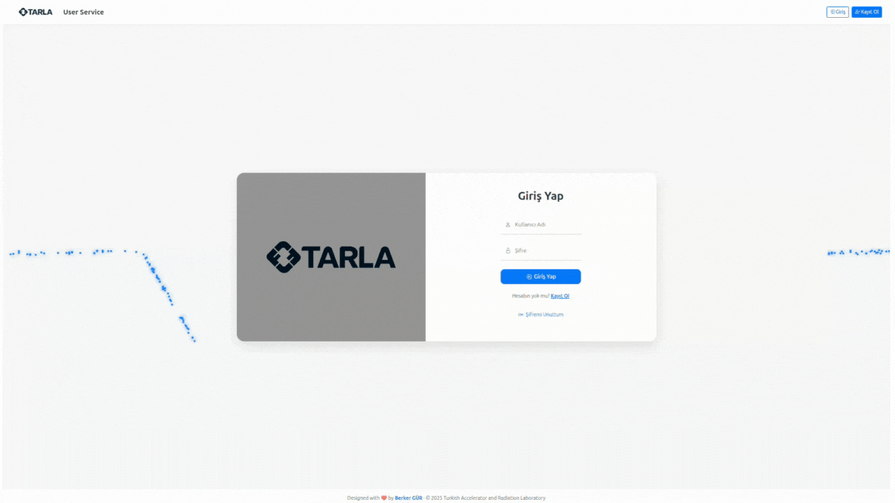
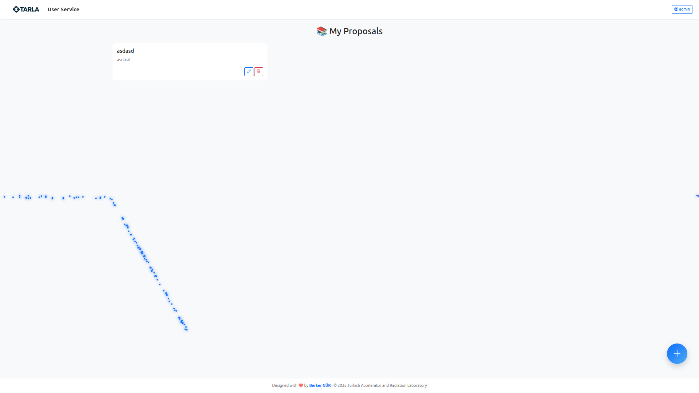
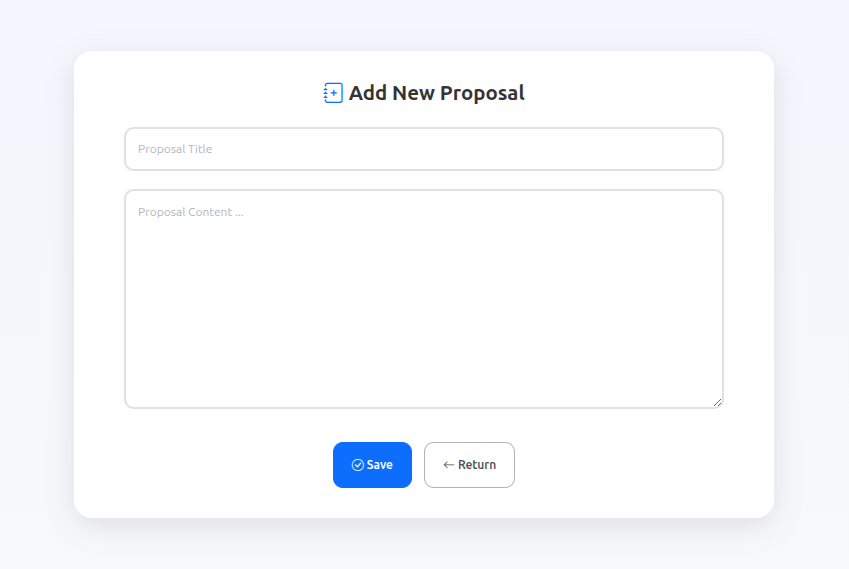

# User Proposal Service

This project was developed using Django.
PostgreSQL was used as the database.
To eliminate dependency issues, the project was containerized into Docker images.
It also includes an Nginx server.

Signup

Signup

New Content
